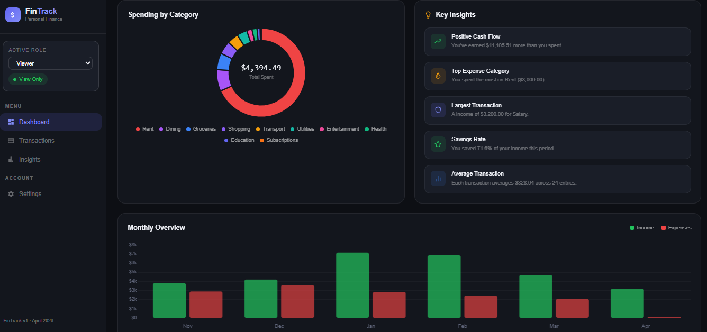
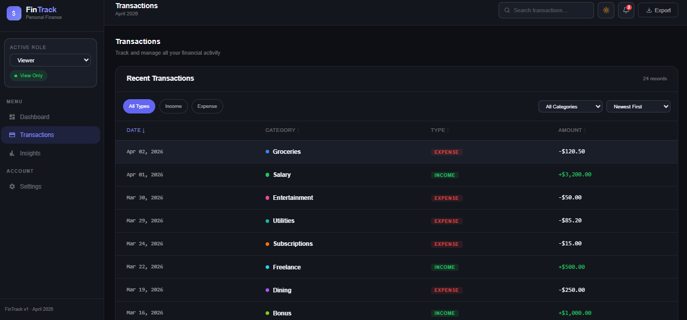
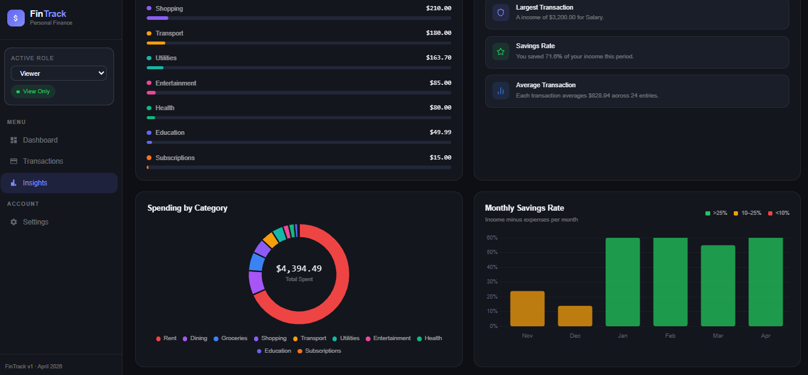
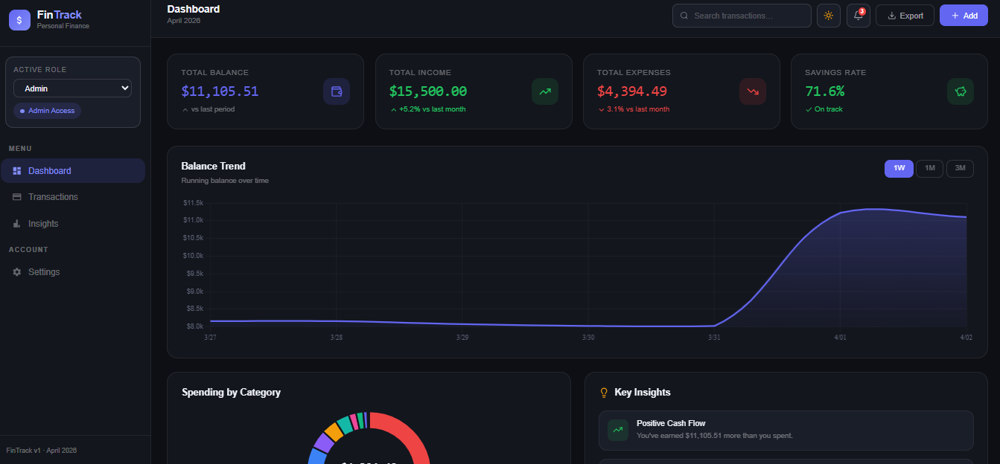
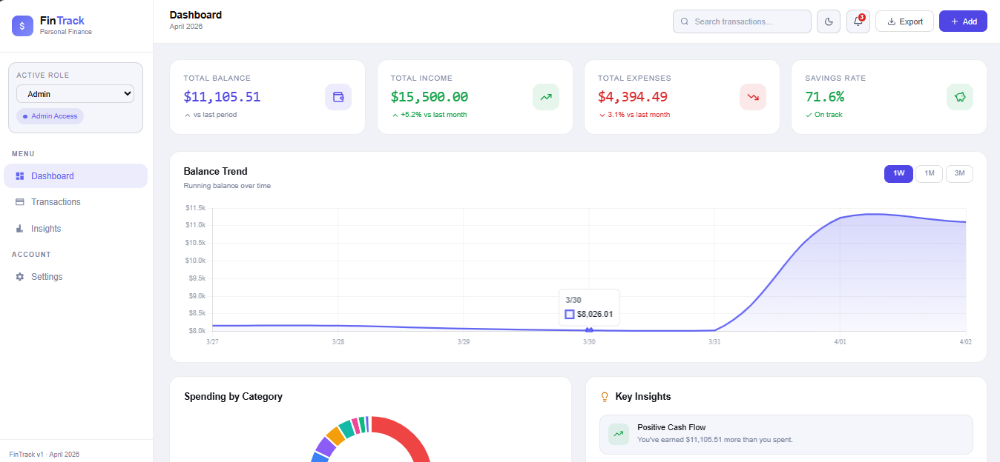
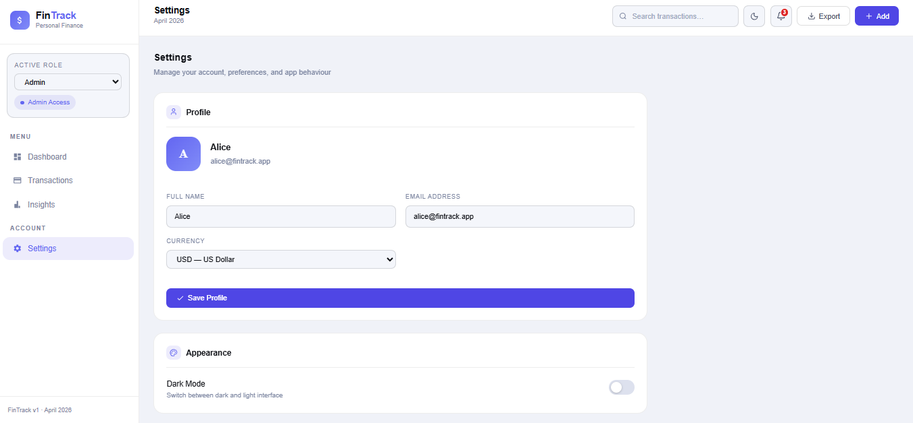

<h1 align="center">💰 FinTrack — Personal Finance Dashboard</h1>

<p align="center">
  
  
  
  
  
</p>

FinTrack is a highly interactive and production-ready financial tracking application built with React 19. It delivers a complete finance management experience focused on performance, scalability, and seamless user interaction.

---

## 🚀 Overview of Approach

This project goes beyond basic CRUD functionality and focuses on building a polished, scalable frontend architecture.

- Custom dark-first design system using Tailwind CSS and CSS variables  
- Fully decoupled architecture (UI, state, data layers separated)  
- Zustand for global state management with localStorage persistence  
- Role-based UI system (Admin vs Viewer)  
- Chart.js for high-performance charts  
- Dedicated responsive system in `responsive.css`  

---

## 🔄 Application Flow

```text
User Action
    │
    ▼
React Component
    │
    ▼
Zustand Store (useStore.js)
    │
    ├── Update State
    ├── Persist to localStorage
    │
    ▼
Derived Data (filters, stats)
    │
    ▼
Component Re-render
    │
    ▼
UI + Charts Update
```

---

## 🔁 Frontend Flow (Detailed)

```text
User Interaction (click / input)
        │
        ▼
Event Handler (onClick / onChange)
        │
        ▼
Zustand Store Function
        │
        ├── updateTransactions
        ├── setTheme
        ├── setRole
        │
        ▼
State Updated
        │
        ▼
localStorage Sync
        │
        ▼
Selectors / Getters Execute
        │
        ▼
UI + Charts Re-render
```

---

## ✨ Core Features

### 📊 Dashboard
- KPI summary cards:
  - Total Balance
  - Total Income
  - Total Expenses
  - Savings Rate
- Balance trend line chart (time-based visualization)
- Spending by category donut chart
- Monthly income vs expenses bar chart
- Auto-generated financial insights panel

---

### 💳 Transactions
- Fully sortable transaction table
- Real-time global search across all fields
- Category-based filtering
- Income/Expense type filters
- Admin capabilities:
  - Add new transaction
  - Edit existing transaction
  - Delete transactions with confirmation
- Viewer mode:
  - Read-only access with restricted controls

---

### 📈 Insights
- Savings analytics overview
- Category-wise expense breakdown
- Monthly savings rate visualization
- Data-driven financial insights

---

### ⚙️ Settings
- Profile editor (name, email, preferences)
- Dark / Light theme toggle
- Role switcher (Admin / Viewer)
- Notification preferences
- Data reset to default state

---

## 🔔 Notification Flow

```text
Event Triggered
      │
      ▼
Add Notification to Store
      │
      ▼
Unread Count Updated
      │
      ▼
UI Badge Updates
      │
      ▼
User Click → Mark as Read
```

---

## 🌙 Theme System Flow

```text
User Toggles Theme
        │
        ▼
Zustand setTheme()
        │
        ▼
Update body class
        │
        ▼
CSS Variables Switch
        │
        ▼
UI Repaints Instantly
        │
        ▼
Charts Re-render with new theme
```

---

## 📤 Export Flow

```text
User Click Export
        │
        ▼
Get Filtered Transactions
        │
        ▼
Convert to CSV / JSON
        │
        ▼
Trigger File Download
```

---

## 🏗️ Architecture

```text
STYLE LAYER
- index.css
- responsive.css
- Tailwind

STATE LAYER
- Zustand store
- localStorage
- getters

DATA LAYER
- transactions.js
- categories
- monthly data

LAYOUT LAYER
- App.jsx
- Sidebar.jsx
- Topbar.jsx

PAGE LAYER
- DashboardPage
- TransactionsPage
- InsightsPage
- SettingsPage

COMPONENT LAYER
- Charts
- UI
- Transactions
```

---

## 🔄 Data Flow

```text
Seed Data (transactions.js)
        │
        ▼
Zustand Store
        │
        ├── CRUD operations
        ├── filtering
        ├── stats calculation
        │
        ▼
Components consume state
        │
        ▼
UI Rendering + Charts
```

---

## 📊 Charts

- 📈 Line chart for tracking balance trends over time  
- 🍩 Donut chart for visualizing spending distribution by category  
- 📊 Bar chart for comparing monthly income vs expenses  
- 💹 Savings rate visualization with performance indicators  
- 📉 Category breakdown using horizontal bars for ranked spending  

---

## 🗂️ Project Structure

```text
frontend/
├── public/
├── src/
│   ├── components/
│   ├── data/
│   ├── hooks/
│   ├── pages/
│   ├── store/
│   ├── utils/
│   ├── App.jsx
│   ├── main.jsx
│   ├── index.css
│   └── responsive.css
├── index.html
├── vite.config.js
└── package.json
```

---

## 🛠️ Tech Stack

| Layer   | Tool          | Purpose        |
|--------|--------------|---------------|
| UI     | React 19      | Rendering      |
| Build  | Vite          | Dev and build  |
| Style  | Tailwind CSS  | Styling        |
| Theme  | CSS Variables | Theming        |
| Charts | Chart.js      | Visualization  |
| State  | Zustand       | Global state   |
| Icons  | Lucide        | Icons          |
| Dates  | date-fns      | Date utilities |
| Persist| localStorage  | Data storage   |

---

## 🔐 Role-Based Access

| Capability      | Admin | Viewer  |
|----------------|------|--------|
| View data       | Yes  | Yes    |
| Export          | Yes  | Yes    |
| Add/Edit/Delete | Yes  | No     |
| UI controls     | Full | Limited|

---

## 📱 Responsive Design

| Device  | Behaviour                      |
|--------|--------------------------------|
| Mobile | Drawer sidebar, stacked layout |
| Tablet | Balanced layout                |
| Desktop| Full dashboard view            |
| Print  | Clean print version            |

---

## ⚙️ Setup

```bash
npm create vite@latest . -- --template react
npm install

npm install -D tailwindcss postcss autoprefixer
npx tailwindcss init -p

npm install chart.js react-chartjs-2 zustand date-fns lucide-react

npm run dev
```

---

## 📜 Scripts

| Command         | Description      |
|----------------|------------------|
| npm run dev     | Start dev server |
| npm run build   | Production build |
| npm run preview | Preview build    |

---

## 💡 Key Decisions

- Zustand for minimal and efficient global state management with no boilerplate  
- CSS variables for scalable and maintainable theming across dark and light modes  
- Chart.js for high-performance, flexible, canvas-based data visualisation  
- Separate `responsive.css` file to keep components clean and free of media queries  
- localStorage for seamless data persistence without requiring a backend  

---

## 🌐 Environment

| Item       | Detail         |
|------------|--------------|
| Backend    | None         |
| Storage    | localStorage |
| Port       | 5173         |
| Deployment | Static hosting |

---

## 📸 Screenshots

### 🏠 Viewer Dashboard Page
<p align="center">
  
</p>

### 💳 Transactions Page
<p align="center">
  
</p>

### 📈 Insights Page
<p align="center">
  
</p>

### 🏠 Admin Dashboard Page
<p align="center">
  
</p>

### 🌙 Theme Toggle to Light
<p align="center">
  
</p>

### ⚙️ Settings Page
<p align="center">
  
</p>

---

Built with React · Tailwind · Zustand · Chart.js · Lucide · Vite · date-fns  
FinTrack  
April 2026
